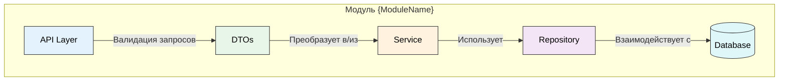

# Создание нового модуля

Это руководство поможет вам создать новый модуль в проекте, следуя установленным стандартам.

## Структура модуля



### Описание компонентов

```
internal/modules/{module_name}/
├── api/                  # API слой (HTTP handlers)
│   ├── dto/             # Data Transfer Objects
│   │   ├── create.go    # DTO для создания
│   │   ├── update.go    # DTO для обновления
│   │   └── response.go  # DTO для ответов API
│   └── handler.go       # HTTP обработчики
├── model/               # Модели данных
│   └── {module_name}.go
├── repository/          # Работа с БД
│   └── {module_name}_repo.go
├── service/             # Бизнес-логика (опционально)
│   └── {module_name}_service.go
└── README.md            # Документация модуля
```

## Взаимодействие компонентов

1. **API Layer** - принимает HTTP-запросы и валидирует входные данные
2. **DTOs** - преобразует данные между API и внутренними моделями
3. **Service** - содержит бизнес-логику модуля
4. **Repository** - отвечает за взаимодействие с базой данных
5. **Model** - определяет структуры данных модуля

## Пошаговое создание модуля

1. Создайте структуру каталогов

2. Создайте модель в `model/{module_name}.go`:
   ```go
   package model

   import "time"

   // {ModuleName} представляет собой ...
   type {ModuleName} struct {
       ID        string    `json:"id"`
       // Добавьте необходимые поля
       CreatedAt time.Time `json:"created_at"`
       UpdatedAt time.Time `json:"updated_at"`
   }
   ```

3. Создайте DTO в `api/dto/`:
   - `create.go` - для входящих данных при создании
   - `update.go` - для входящих данных при обновлении
   - `response.go` - для исходящих данных

4. Реализуйте репозиторий в `repository/{module_name}_repo.go`:
   ```go
   package repository

   import (
       "context"
       "github.com/pksep/location_search_server/internal/modules/{module_name}/model"
   )

   type {ModuleName}Repo struct {
       db *pgxpool.Pool
   }

   func New{ModuleName}Repo(db *pgxpool.Pool) *{ModuleName}Repo {
       return &{ModuleName}Repo{db: db}
   }
   
   // Реализуйте CRUD методы
   ```

5. Создайте обработчики API в `api/handler.go`:
   ```go
   package api

   import (
       "github.com/gin-gonic/gin"
       "github.com/pksep/location_search_server/internal/modules/{module_name}/repository"
   )

   type {ModuleName}Handler struct {
       repo *repository.{ModuleName}Repo
   }

   func New{ModuleName}Handler(repo *repository.{ModuleName}Repo) *{ModuleName}Handler {
       return &{ModuleName}Handler{repo: repo}
   }

   func (h *{ModuleName}Handler) RegisterRoutes(rg *gin.RouterGroup) {
       module := rg.Group("/{module_name}s")
       {
           module.POST("", h.Create)
           module.GET("", h.List)
           module.GET("/:id", h.Get)
           module.PUT("/:id", h.Update)
           module.DELETE("/:id", h.Delete)
       }
   }
   ```

6. Зарегистрируйте маршруты в `internal/api/routes.go`:
   ```go
   // Добавьте зависимость в RouterDeps
   type RouterDeps struct {
       // ...
       {ModuleName}Repo *{module_name}.repository.{ModuleName}Repo
   }

   // В функции RegisterRoutes добавьте:
   {moduleName}Handler := {module_name}.New{ModuleName}Handler(deps.{ModuleName}Repo)
   {moduleName}Handler.RegisterRoutes(api)
   ```

7. Обновите `cmd/server/main.go` для инициализации репозитория:
   ```go
   // В main() добавьте:
   {moduleName}Repo := {module_name}.New{ModuleName}Repo(pool)
   
   // И передайте в deps:
   deps := &api.RouterDeps{
       // ...
       {ModuleName}Repo: {moduleName}Repo,
   }
   ```

8. Создайте миграции для новой таблицы (если нужно):
   ```bash
   make migration-create NAME=create_{module_name}s_table
   ```

## Документирование модуля

1. Добавьте Swagger документацию к обработчикам
2. Задокументируйте все публичные методы и типы
3. Обновите общую документацию API

## Тестирование

1. Создайте unit-тесты для репозитория
2. Создайте интеграционные тесты для API
3. Проверьте валидацию входных данных

## Примеры

См. существующие модули (например, `users`) в качестве примера реализации.
